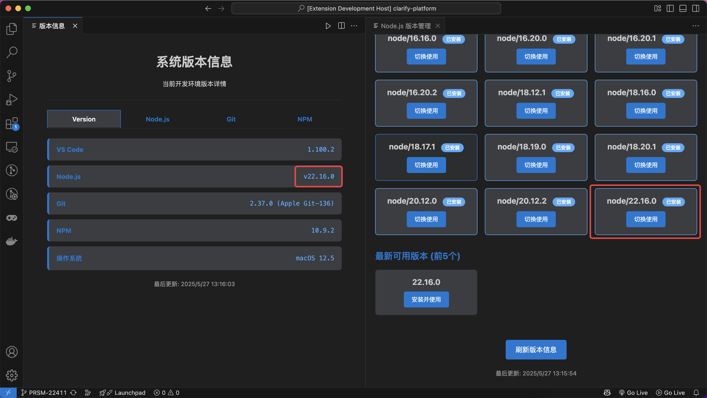
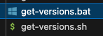
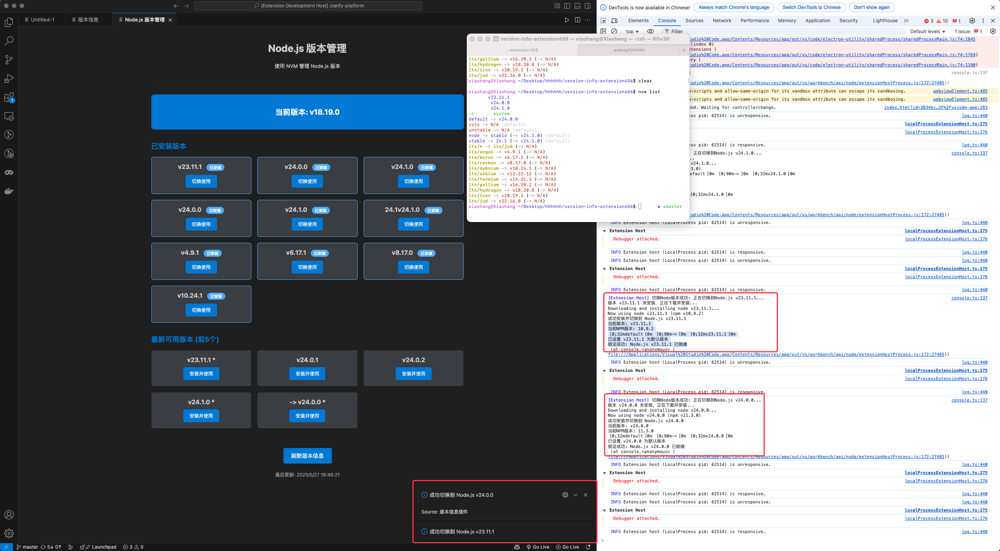
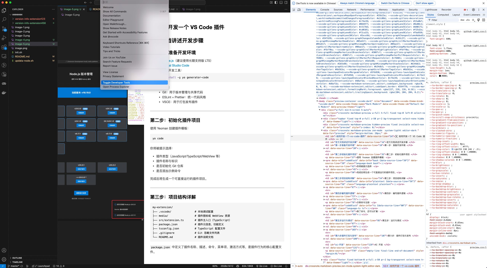

<!-- # hhhhhh
版本信息


node版本切换



function List
 -->


## 🛠️ 如何开发一个 VS Code 插件 

## 官方文档讲述开发步骤

### 第一步：准备开发环境

1. 安装 [Node.js](https://nodejs.org/)（建议使用长期支持版 LTS）
2. 安装 [Visual Studio Code](https://code.visualstudio.com/)
3. 安装扩展开发工具：

   ```bash
   npm install -g yo generator-code
   ```
4. 可选工具：

   * Git：用于版本管理与共享代码
   * ESLint + Prettier：统一代码风格
   * VSCE：用于打包发布插件

---

### 第二步：初始化插件项目

使用 Yeoman 创建插件模板：

```bash
yo code
```

你将被提示选择：

* 插件类型（JavaScript/TypeScript/WebView 等）
* 插件名称与标识
* 是否初始化 Git 仓库
* 是否添加示例命令

完成后将生成一个可直接运行的插件项目。

---

### 第三步：项目结构详解

```plaintext
my-extension/
├── .vscode/               # 本地调试配置
├── media/                 # 插件图标或 WebView 资源
├── src/extension.ts       # 插件主入口（TypeScript）
├── package.json           # 插件元信息，功能定义
├── tsconfig.json          # TypeScript 配置文件
├── .gitignore             # Git 忽略文件列表
└── README.md              # 插件说明文档
```

`package.json` 中定义了插件名称、描述、命令、菜单项、激活方式等，是插件行为的核心配置文件。

---

### 第四步：编写插件逻辑

插件主函数通常写在 `src/extension.ts` 中。核心结构包括两个方法：

* `activate(context: vscode.ExtensionContext)`：插件激活时执行
* `deactivate()`：插件卸载前执行

示例命令注册：

```ts
let disposable = vscode.commands.registerCommand('extension.helloWorld', () => {
  vscode.window.showInformationMessage('Hello from HelloWorld Plugin!');
});
context.subscriptions.push(disposable);
```

除了命令，还可以扩展：

* Tree View：如 Git 插件左侧资源树
* WebView：加载自定义 HTML 界面
* CodeLens、Hover、StatusBar 等 VS Code API 提供的功能

---

### 第五步：运行与调试

在 VS Code 中按 `F5` 会自动：

1. 编译插件代码（TypeScript）
2. 启动 Extension Development Host 实例
3. 载入你的插件并允许测试其功能

也可以在 `launch.json` 中自定义调试参数。

---

### 第六步：插件打包与发布

1. 安装打包工具 VSCE：

   ```bash
   npm install -g @vscode/vsce
   ```
2. 构建并打包插件：

   ```bash
   vsce package
   ```
3. 注册并登录 Publisher：[注册页面](https://marketplace.visualstudio.com/manage)
4. 发布插件：

   ```bash
   vsce publish
   ```


---

## AI 开发

1. 梳理需求
   1. 开发环境信息
   2. Node 版本切换
   3. Function List 和 跳转
2. 使用 claude 和 chatgpt 完成
   1. 生成一个 当前环境版本信息插件 包含 vscode node git npm 使用 bash 脚本的形式展示 
   在 win 环境下获取版本信息时， 使用 .bat 文件，运行失败，将这段判断全部删除，使用 .sh 文件获取信息
   
   
   ```bash
        #!/bin/bash

    # VS Code版本信息插件自动生成脚本
    # 使用方法: bash create-vscode-plugin.sh [项目名称]

    set -e  # 遇到错误时退出

    # 默认项目名称
    PROJECT_NAME=${1:-"version-info-extension456"}

    echo "🚀 开始创建 VS Code 插件项目: $PROJECT_NAME"

    # 创建项目根目录
    mkdir -p "$PROJECT_NAME"
    cd "$PROJECT_NAME"

    # 创建目录结构
    echo "📁 创建目录结构..."
    mkdir -p src/webview
    mkdir -p scripts
    mkdir -p media
    mkdir -p .vscode

    echo "📝 创建 package.json..."
    cat > package.json << 'EOF'
    {
      "name": "version-info-extension",
      "displayName": "版本信息查看器",
      "description": "显示 VS Code、Node.js 和 Git 版本信息",
      "version": "1.0.0",
      "engines": {
        "vscode": "^1.74.0"
      },
      "categories": ["Other"],
      "activationEvents": ["onStartupFinished"],
      "main": "./out/extension.js",
      "contributes": {
        "commands": [
          {
            "command": "versionInfo.show",
            "title": "显示版本信息",
            "category": "版本信息"
          },
          {
            "command": "versionInfo.refresh",
            "title": "刷新版本信息",
            "category": "版本信息"
          }
        ],
        "views": {
          "explorer": [
            {
              "id": "versionInfoView",
              "name": "版本信息",
              "when": "true"
            }
          ]
        },
        "viewsContainers": {
          "panel": [
            {
              "id": "versionInfoPanel",
              "title": "版本信息",
              "icon": "$(info)"
            }
          ]
        },
        "menus": {
          "view/title": [
            {
              "command": "versionInfo.refresh",
              "when": "view == versionInfoView",
              "group": "navigation"
            }
          ]
        }
      },
      "scripts": {
        "vscode:prepublish": "npm run compile",
        "compile": "tsc -p ./",
        "watch": "tsc -watch -p ./"
      },
      "devDependencies": {
        "@types/vscode": "^1.74.0",
        "@types/node": "16.x",
        "typescript": "^4.9.4"
      }
    }
    EOF

    echo "📝 创建 tsconfig.json..."
    cat > tsconfig.json << 'EOF'
    {
        "compilerOptions": {
            "module": "commonjs",
            "target": "ES2020",
            "outDir": "out",
            "lib": [
                "ES2020"
            ],
            "sourceMap": true,
            "rootDir": "src",
            "strict": true
        },
        "exclude": [
            "node_modules",
            ".vscode-test"
        ]
    }
    EOF

    echo "📝 创建 .gitignore..."
    cat > .gitignore << 'EOF'
    out/
    node_modules/
    .vscode-test/
    *.vsix
    .DS_Store
    EOF

    echo "📝 创建 README.md..."
    cat > README.md << 'EOF'
    # 版本信息查看器

    这是一个VS Code插件，用于显示当前系统中VS Code、Node.js、Git等工具的版本信息。

    ## 功能特性

    - 📊 显示 VS Code 版本
    - 🟢 显示 Node.js 版本
    - 📁 显示 Git 版本
    - 📦 显示 NPM 版本
    - 💻 显示操作系统信息
    - 🔄 支持手动刷新
    - 🎨 美观的界面设计

    ## 安装方法

    1. 克隆或下载此项目
    2. 在项目根目录运行 `npm install`
    3. 按 F5 启动开发模式
    4. 在新窗口中测试插件功能

    ## 使用方法

    5. 安装插件后，在VS Code资源管理器侧边栏会出现"版本信息"面板
    6. 使用 `Ctrl+Shift+P`（或 `Cmd+Shift+P`）打开命令面板
    7. 输入"显示版本信息"或"刷新版本信息"来执行相应操作

    ## 支持的平台

    - Windows
    - macOS
    - Linux

    ## 技术栈

    - TypeScript
    - VS Code Extension API
    - Bash/Batch 脚本
    EOF

    echo "📝 创建 .vscode/launch.json..."
    cat > .vscode/launch.json << 'EOF'
    {
        "version": "0.2.0",
        "configurations": [
            {
                "name": "Run Extension",
                "type": "extensionHost",
                "request": "launch",
                "args": [
                    "--extensionDevelopmentPath=${workspaceFolder}"
                ]
            }
        ]
    }
    EOF

    echo "📝 创建 .vscode/settings.json..."
    cat > .vscode/settings.json << 'EOF'
    {
        "typescript.preferences.importModuleSpecifier": "relative"
    }
    EOF

    echo "📝 创建 src/extension.ts..."
    cat > src/extension.ts << 'EOF'
    import * as vscode from 'vscode';
    import { VersionProvider } from './versionProvider';
    import { VersionPanel } from './webview/versionPanel';

    export function activate(context: vscode.ExtensionContext) {
        console.log('版本信息插件已激活');

        const versionProvider = new VersionProvider(context);
        const versionPanel = new VersionPanel(context);

        // 注册树视图提供者
        vscode.window.registerTreeDataProvider('versionInfoView', versionProvider);

        // 注册命令
        const showCommand = vscode.commands.registerCommand('versionInfo.show', () => {
            versionPanel.createOrShow();
        });

        const refreshCommand = vscode.commands.registerCommand('versionInfo.refresh', () => {
            versionProvider.refresh();
            versionPanel.refresh();
        });

        context.subscriptions.push(showCommand, refreshCommand);

        // 自动显示面板
        versionPanel.createOrShow();
    }

    export function deactivate() {}
    EOF

    echo "📝 创建 src/versionProvider.ts..."
    cat > src/versionProvider.ts << 'EOF'
    import * as vscode from 'vscode';
    import * as cp from 'child_process';
    import * as path from 'path';

    export interface VersionInfo {
        vscode: string;
        node: string;
        git: string;
        npm: string;
        os: string;
    }

    export class VersionProvider implements vscode.TreeDataProvider<VersionItem> {
        private _onDidChangeTreeData: vscode.EventEmitter<VersionItem | undefined | null | void> = new vscode.EventEmitter<VersionItem | undefined | null | void>();
        readonly onDidChangeTreeData: vscode.Event<VersionItem | undefined | null | void> = this._onDidChangeTreeData.event;

        private versionInfo: VersionInfo = {
            vscode: '',
            node: '',
            git: '',
            npm: '',
            os: ''
        };

        constructor(private context: vscode.ExtensionContext) {
            this.loadVersionInfo();
        }

        refresh(): void {
            this.loadVersionInfo();
            this._onDidChangeTreeData.fire();
        }

        getTreeItem(element: VersionItem): vscode.TreeItem {
            return element;
        }

        getChildren(element?: VersionItem): Thenable<VersionItem[]> {
            if (!element) {
                return Promise.resolve([
                    new VersionItem('VS Code', this.versionInfo.vscode, vscode.TreeItemCollapsibleState.None),
                    new VersionItem('Node.js', this.versionInfo.node, vscode.TreeItemCollapsibleState.None),
                    new VersionItem('Git', this.versionInfo.git, vscode.TreeItemCollapsibleState.None),
                    new VersionItem('NPM', this.versionInfo.npm, vscode.TreeItemCollapsibleState.None),
                    new VersionItem('操作系统', this.versionInfo.os, vscode.TreeItemCollapsibleState.None)
                ]);
            }
            return Promise.resolve([]);
        }

        private async loadVersionInfo(): Promise<void> {
            try {
                // 获取 VS Code 版本
                this.versionInfo.vscode = vscode.version;

                // 使用 bash 脚本获取其他版本信息
                const scriptPath = this.getScriptPath();
                const result = await this.executeScript(scriptPath);
                
                if (result) {
                    this.parseScriptOutput(result);
                }
            } catch (error) {
                console.error('获取版本信息失败:', error);
            }
        }

        private getScriptPath(): string {
            const scriptName = 'get-versions.sh';
            return path.join(this.context.extensionPath, 'scripts', scriptName);
        }

        private executeScript(scriptPath: string): Promise<string> {
            return new Promise((resolve, reject) => {
                const command = `bash "${scriptPath}"`;
                
                cp.exec(command, { encoding: 'utf8' }, (error, stdout, stderr) => {
                    if (error) {
                        console.error('脚本执行错误:', error);
                        reject(error);
                        return;
                    }
                    resolve(stdout);
                });
            });
        }

        private parseScriptOutput(output: string): void {
            const lines = output.split('\n');
            lines.forEach(line => {
                const [key, value] = line.split(':').map(s => s.trim());
                switch (key) {
                    case 'NODE':
                        this.versionInfo.node = value || '未安装';
                        break;
                    case 'GIT':
                        this.versionInfo.git = value || '未安装';
                        break;
                    case 'NPM':
                        this.versionInfo.npm = value || '未安装';
                        break;
                    case 'OS':
                        this.versionInfo.os = value || '未知';
                        break;
                }
            });
        }

        getVersionInfo(): VersionInfo {
            return this.versionInfo;
        }
    }

    class VersionItem extends vscode.TreeItem {
        constructor(
            public readonly label: string,
            public readonly version: string,
            public readonly collapsibleState: vscode.TreeItemCollapsibleState
        ) {
            super(label, collapsibleState);
            this.tooltip = `${this.label}: ${this.version}`;
            this.description = this.version;
        }
    }
    EOF

    echo "📝 创建 src/webview/versionPanel.ts..."
    cat > src/webview/versionPanel.ts << 'EOF'
    import * as vscode from 'vscode';
    import * as path from 'path';
    import { VersionProvider } from '../versionProvider';

    export class VersionPanel {
        public static currentPanel: VersionPanel | undefined;
        private readonly _panel: vscode.WebviewPanel;
        private _disposables: vscode.Disposable[] = [];
        private versionProvider: VersionProvider;

        public static readonly viewType = 'versionInfo';

        constructor(private readonly context: vscode.ExtensionContext) {
            this.versionProvider = new VersionProvider(context);
        }

        public createOrShow(): void {
            const column = vscode.ViewColumn.Two;

            if (VersionPanel.currentPanel) {
                VersionPanel.currentPanel._panel.reveal(column);
                return;
            }

            const panel = vscode.window.createWebviewPanel(
                VersionPanel.viewType,
                '版本信息',
                column,
                {
                    enableScripts: true,
                    localResourceRoots: [
                        vscode.Uri.file(path.join(this.context.extensionPath, 'src', 'webview'))
                    ]
                }
            );

            VersionPanel.currentPanel = new VersionPanel(this.context);
            VersionPanel.currentPanel._panel = panel;
            VersionPanel.currentPanel._update();

            panel.onDidDispose(() => this.dispose(), null, this._disposables);
        }

        public refresh(): void {
            if (VersionPanel.currentPanel) {
                VersionPanel.currentPanel._update();
            }
        }

        public dispose(): void {
            VersionPanel.currentPanel = undefined;

            this._panel.dispose();

            while (this._disposables.length) {
                const x = this._disposables.pop();
                if (x) {
                    x.dispose();
                }
            }
        }

        private _update(): void {
            const webview = this._panel.webview;
            this._panel.title = '版本信息';
            this._panel.webview.html = this._getHtmlForWebview(webview);
        }

        private _getHtmlForWebview(webview: vscode.Webview): string {
            const versionInfo = this.versionProvider.getVersionInfo();

            return `<!DOCTYPE html>
    <html lang="zh-CN">
    <head>
        <meta charset="UTF-8">
        <meta name="viewport" content="width=device-width, initial-scale=1.0">
        <title>版本信息</title>
        <style>
            body {
                font-family: var(--vscode-font-family);
                font-size: var(--vscode-font-size);
                color: var(--vscode-foreground);
                background-color: var(--vscode-editor-background);
                padding: 20px;
                margin: 0;
            }
            .version-container {
                max-width: 600px;
                margin: 0 auto;
            }
            .version-header {
                text-align: center;
                margin-bottom: 30px;
                padding-bottom: 20px;
                border-bottom: 1px solid var(--vscode-panel-border);
            }
            .version-item {
                display: flex;
                justify-content: space-between;
                align-items: center;
                padding: 15px;
                margin-bottom: 10px;
                background-color: var(--vscode-editor-inactiveSelectionBackground);
                border-radius: 6px;
                border-left: 4px solid var(--vscode-button-background);
            }
            .version-label {
                font-weight: bold;
                color: var(--vscode-button-background);
            }
            .version-value {
                font-family: var(--vscode-editor-font-family);
                color: var(--vscode-textLink-foreground);
            }
            .refresh-btn {
                background-color: var(--vscode-button-background);
                color: var(--vscode-button-foreground);
                border: none;
                padding: 10px 20px;
                border-radius: 4px;
                cursor: pointer;
                font-size: 14px;
                margin-top: 20px;
            }
            .refresh-btn:hover {
                background-color: var(--vscode-button-hoverBackground);
            }
            .timestamp {
                text-align: center;
                color: var(--vscode-descriptionForeground);
                font-size: 12px;
                margin-top: 20px;
            }
        </style>
    </head>
    <body>
        <div class="version-container">
            <div class="version-header">
                <h1>系统版本信息</h1>
                <p>当前开发环境版本详情</p>
            </div>
            
            <div class="version-item">
                <span class="version-label">VS Code</span>
                <span class="version-value">${versionInfo.vscode || '获取中...'}</span>
            </div>
            
            <div class="version-item">
                <span class="version-label">Node.js</span>
                <span class="version-value">${versionInfo.node || '获取中...'}</span>
            </div>
            
            <div class="version-item">
                <span class="version-label">Git</span>
                <span class="version-value">${versionInfo.git || '获取中...'}</span>
            </div>
            
            <div class="version-item">
                <span class="version-label">NPM</span>
                <span class="version-value">${versionInfo.npm || '获取中...'}</span>
            </div>
            
            <div class="version-item">
                <span class="version-label">操作系统</span>
                <span class="version-value">${versionInfo.os || '获取中...'}</span>
            </div>
            
            <div class="timestamp">
                最后更新: ${new Date().toLocaleString('zh-CN')}
            </div>
        </div>
    </body>
    </html>`;
        }
    }
    EOF

    echo "📝 创建 scripts/get-versions.sh..."
    cat > scripts/get-versions.sh << 'EOF'
    #!/bin/bash

    # 获取版本信息的 Bash 脚本

    echo "正在获取版本信息..."

    # 获取 Node.js 版本
    NODE_VERSION=""
    if command -v node &> /dev/null; then
        NODE_VERSION=$(node --version 2>/dev/null)
    fi

    # 获取 Git 版本
    GIT_VERSION=""
    if command -v git &> /dev/null; then
        GIT_VERSION=$(git --version 2>/dev/null | sed 's/git version //')
    fi

    # 获取 NPM 版本
    NPM_VERSION=""
    if command -v npm &> /dev/null; then
        NPM_VERSION=$(npm --version 2>/dev/null)
    fi

    # 获取操作系统信息
    OS_INFO=""
    if [[ "$OSTYPE" == "linux-gnu"* ]]; then
        OS_INFO="Linux $(uname -r)"
    elif [[ "$OSTYPE" == "darwin"* ]]; then
        OS_INFO="macOS $(sw_vers -productVersion)"
    elif [[ "$OSTYPE" == "msys" || "$OSTYPE" == "cygwin" ]]; then
        OS_INFO="Windows $(cmd //c ver 2>/dev/null | grep -o '[0-9]\+\.[0-9]\+\.[0-9]\+')"
    else
        OS_INFO="Unknown OS"
    fi

    # 输出结果
    echo "NODE: ${NODE_VERSION:-未安装}"
    echo "GIT: ${GIT_VERSION:-未安装}"
    echo "NPM: ${NPM_VERSION:-未安装}"
    echo "OS: ${OS_INFO:-未知}"
    EOF

    # 设置脚本执行权限
    chmod +x scripts/get-versions.sh

    echo "🎯 创建项目安装和运行脚本..."
    cat > install-and-run.sh << 'EOF'
    #!/bin/bash

    echo "🔧 安装项目依赖..."
    npm install

    echo "🔨 编译 TypeScript..."
    npm run compile

    echo "✅ 项目创建完成！"
    echo ""
    echo "📋 接下来的步骤："
    echo "1. 在 VS Code 中打开项目文件夹"
    echo "2. 按 F5 启动扩展调试模式"
    echo "3. 在新窗口中测试插件功能"
    echo ""
    echo "🚀 或者直接运行: code . && code --extensionDevelopmentPath=."
    EOF

    chmod +x install-and-run.sh

    echo ""
    echo "🎉 项目创建完成！"
    echo "📁 项目目录: $(pwd)"
    echo ""
    echo "📋 项目结构："
    find . -type f -name "*.json" -o -name "*.ts" -o -name "*.sh" -o -name "*.md" | sort
    echo ""
    echo "🔧 下一步操作："
    echo "1. cd $PROJECT_NAME"
    echo "2. bash install-and-run.sh"
    echo "3. 在 VS Code 中按 F5 启动调试"
    echo ""
    echo "✨ 享受您的 VS Code 插件开发之旅！"
   ```
   效果图
   

   2. 生成一个 node 版本切换页面，使用 nvm 控制 node 版本， 使用 bash 脚本，升级当前代码
    在 win 环境下 nvm 运行环境有问题，暂时不兼容 win
    
    
    


   3. 生成一个获取当前页面 Function list 的页面，包含函数位置跳转（AI 额度上限 手动粘贴
    _panel 引用错误
    ```ts
      this._panel
      VersionPanel.currentPanel?._panel?.webview.postMessage
    ```
    vscode 重复引用报错，阻碍JS 执行
    ```ts
    const vscode = acquireVsCodeApi();
    ```
    


### 插件调试
Help -> Toggle Developer Tools 



