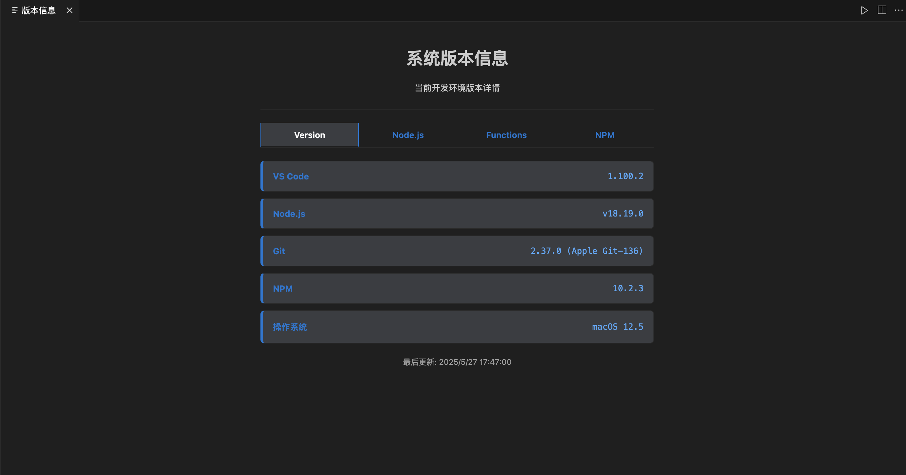
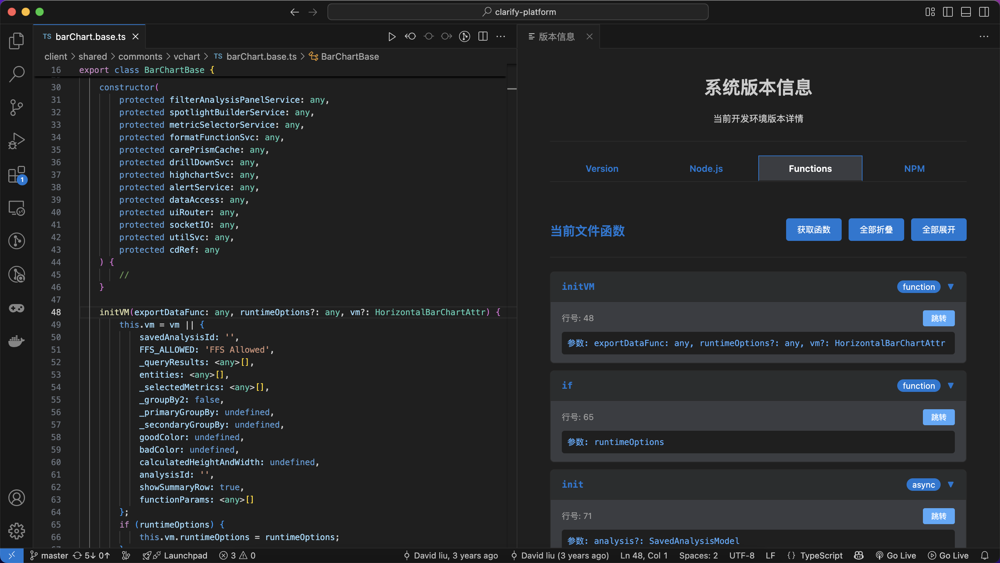

<!-- # hhhhhh
版本信息


node版本切换


function List
 -->


## 🛠️ 如何开发一个 VS Code 插件 

## 官方文档讲述开发步骤

### 第一步：准备开发环境

1. 安装 [Node.js](https://nodejs.org/)（建议使用长期支持版 LTS）
2. 安装 [Visual Studio Code](https://code.visualstudio.com/)
3. 安装扩展开发工具：

   ```bash
   npm install -g yo generator-code
   ```
4. 可选工具：

   * Git：用于版本管理与共享代码
   * ESLint + Prettier：统一代码风格
   * VSCE：用于打包发布插件

---

### 第二步：初始化插件项目

使用 Yeoman 创建插件模板：

```bash
yo code
```

你将被提示选择：

* 插件类型（JavaScript/TypeScript/WebView 等）
* 插件名称与标识
* 是否初始化 Git 仓库
* 是否添加示例命令

完成后将生成一个可直接运行的插件项目。

---

### 第三步：项目结构详解

```plaintext
my-extension/
├── .vscode/               # 本地调试配置
├── media/                 # 插件图标或 WebView 资源
├── src/extension.ts       # 插件主入口（TypeScript）
├── package.json           # 插件元信息，功能定义
├── tsconfig.json          # TypeScript 配置文件
├── .gitignore             # Git 忽略文件列表
└── README.md              # 插件说明文档
```

`package.json` 中定义了插件名称、描述、命令、菜单项、激活方式等，是插件行为的核心配置文件。

---

### 第四步：编写插件逻辑

插件主函数通常写在 `src/extension.ts` 中。核心结构包括两个方法：

* `activate(context: vscode.ExtensionContext)`：插件激活时执行
* `deactivate()`：插件卸载前执行

示例命令注册：

```ts
let disposable = vscode.commands.registerCommand('extension.helloWorld', () => {
  vscode.window.showInformationMessage('Hello from HelloWorld Plugin!');
});
context.subscriptions.push(disposable);
```

除了命令，还可以扩展：

* Tree View：如 Git 插件左侧资源树
* WebView：加载自定义 HTML 界面
* CodeLens、Hover、StatusBar 等 VS Code API 提供的功能

---

### 第五步：运行与调试

在 VS Code 中按 `F5` 会自动：

1. 编译插件代码（TypeScript）
2. 启动 Extension Development Host 实例
3. 载入你的插件并允许测试其功能

也可以在 `launch.json` 中自定义调试参数。

---

### 第六步：插件打包与发布

1. 安装打包工具 VSCE：

   ```bash
   npm install -g @vscode/vsce
   ```
2. 构建并打包插件：

   ```bash
   vsce package
   ```
3. 注册并登录 Publisher：[注册页面](https://marketplace.visualstudio.com/manage)
4. 发布插件：

   ```bash
   vsce publish
   ```


---

## AI 开发

1. 梳理需求
   1. 开发环境信息
   2. Node 版本切换
   3. Function List 和 跳转
2. 使用 claude 和 chatgpt 完成
   1. 生成一个 当前环境版本信息插件 包含 vscode node git npm 使用 bash 脚本的形式展示 
      https://github.com/Xiaohang0316/hhhhhh/blob/master/init.sh
   在 win 环境下获取版本信息时， 使用 .bat 文件，运行失败，将这段判断全部删除，使用 .sh 文件获取信息
   
   
   效果图
   

   2. 生成一个 node 版本切换页面，使用 nvm 控制 node 版本， 使用 bash 脚本，升级当前代码
      https://github.com/Xiaohang0316/hhhhhh/blob/master/updata-node.sh
    在 win 环境下 nvm 运行环境有问题，暂时不兼容 win
    
    
    
    


   3. 生成一个获取当前页面 Function list 的页面，包含函数位置跳转（AI 额度上限 手动粘贴
    _panel 引用错误
    ```ts
      this._panel
      VersionPanel.currentPanel?._panel?.webview.postMessage
    ```
    vscode 重复引用报错，阻碍JS 执行
    ```ts
    const vscode = acquireVsCodeApi();
    ```
    


### 插件调试
Help -> Toggle Developer Tools 


